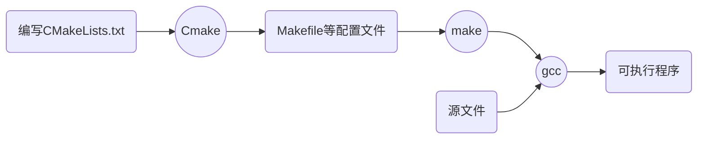

# Cmake基础

#### 目录

[TOC]

---

## 一. Cmake简介

### 1. gcc

gcc是用来编译c文件的编译器，简单来说给它输入一个（或几个）c文件，它可以输出一个可执行文件。当你的程序只有一个源文件时，直接就可以用gcc命令编译它。但是当你的程序包含很多个源文件时，用gcc命令逐个去编译时，你就很容易混乱而且工作量大。

### 2. make

因此出现了make工具，它本身没有编译和链接功能，但是它可以按照**Makefile**文件中的命令调用gcc来编译工程。有了make，我们就不用一个一个文件去编译，只要把他们的编译指令都写在Makefile中，然后make就可以一键完成。

但是当遇到大项目时，Makefile的书写也很麻烦。

### 3.Cmake

为了进一步简化makefile的书写，出现了Cmake。Cmake根据**CMakeLists.txt**文件生成项目的makefile，而CMakeLists.txt的书写相比Makefile大大简化。

总的来说，Cmake，make，gcc组成了一个工具链，让我们在构建项目时只需要编写源文件以及CmakeLists.txt即可，它的流程如下：



[回到目录](#目录)

## 二. 基本规则

### 1. 变量

使用`${}`方式取值，**变量名分大小写**（指令名不分大小写）。

定义一个变量可以用**SET**指令：

```cmake
SET(valname main.c src1.c src2.c)
```

这条语句就是定义一个名字叫`valname`的变量，它的值是`main.c src1.c src2.c`；相当于是 valname = main.c src1.c src2.c

> **系统预定义的变量**
>
> 在我们使用`PROJECT`指令指定工程名<projectname>后，Cmake会自动生成两个变量：
>
> * <projectname>_BINARY_DIR：可执行程序目录，其实是执行cmake命令时的当前目录，比如在build/外部编译，那么就是build的绝对路径
> *  <projectname>_SOURCE_DIR：源文件目录，就是主Cmakelists.txt所在的绝对路径。
>
> 我们可以使用它们。
>
> 同时系统还会帮我们预定义两个与工程名无关的变量，它们的内容与上述两个变量相同，但是好处是变量名不会因为工程名改变而改变，因此推荐使用：
>
> - PROJECT_BINARY_DIR：可执行程序目录
> - PROJECT_SOURCE_DIR：源文件目录

### 2. 指令

指令就是Cmake里的函数。它的**名称不分大小写**，调用格式如下：

* 指令名(参数1  参数2  参数3)

参数之间用空格或分号分开。

如果参数中包含括号，可以使用双引号将参数分开，如下所示：

```cmake
SET(val fu n.c)  # 指令会认为是'fu n.c'是两个参数
SET(val “fu n.c”)  # 使用双引号避免错误
```

### 3. 使用

cmake命令用于生成中间文件，使用时要传入CMakeLists.txt文件所在的目录。如果在主目录下直接生成配置文件，**内部构建**，这样做的坏处是使代码文件与中间文件相互混杂，因此更好的做法是**外部构建**。

在主目录下

```shell
mkdir build && cd build # 用于存放中间文件
cmake ..  # 因为CMakeLists.txt在上一级目录中
make
```

### 4. 工程目录结构

一个良好的工程目录应该如下：

```shell
hello/	# 根目录
├── CMakeLists.txt	# 工程的cmakelists
├── CopyRight	    # 版权声明 
├── README		    # 说明
├── runhello.sh		# 调用二进制文件的脚本
├── bin/		# 存放编译生成二进制文件			
├── build/		# 存放cmake生成的中间配置文件
├── doc/		# 存放文本文档
└── src/		# 存放代码文档
    ├── hello.c
    └── CMakeLists.txt  # 要为任何代码目录添加Cmakelists
```

最终安装工程时，如下操作：

```shell
# 把bin/下文件和runhello.sh装到可执行文件目录下面
mv bin/* runhello.sh  -t  /usr/bin
# 把doc/*，README，CopyRight装到/usr/share/doc/hello下面
sudo mkdir /usr/share/doc/hello
mv doc/* README CopyRight -t /usr/share/doc/hello
```

[回到目录](#目录)

## 三. 具体指令

### 1. 最低Cmake版本

每个CMakeLists.txt文件都必须有。

```cmake
CMAKE_MINIMUm_REQUIRED(VERSION 2.6)
```

### 2. 指定工程名

```CMAKE
PROJECT(PRJNAME)
```

### 3. 输出提示信息

```CMAKE
MESSAGE(STATUS "This is binary dir" ${PROJECT_BINARY_DIR})
```

第一个参数表示输出的信息类型，有三种选项：

* STATUS：输出前缀为--的信息。
* SEND_ERROR：产生错误，生成过程被跳过。
* FATAL_ERROR：重要错误，cmake进程终止。

### 3. 添加要编译的可执行程序

```cmake
ADD_EXECUTABLE(hello main.c src1.c)  # hello为一个target
```

等效于在makefile里写

```makefile
hello: main.c src1.c
	gcc -o hello main.c src1.c	
```

### 4. 指定子目录

由于子目录src下也有CMakeLists.txt,是用来编译源代码的，如果不在主目录下的cmakelists里声明子目录，就不会包含这部分代码，因此主目录的文件中需要添加：

```cmake
ADD_SUBDIRECTORY(src  bin  exclude)
```

* src：将源文件存放的src目录加入工程，**相对于主目录**，也即`PROJECT_SOURCE_DIR`
* bin：将编译输出到bin，若不指定则输出到src中，此处的bin是相对于**编译时所在目录**，也即`PROJECT_BINARY_DIR`
* exclude：编译时排除的目录

注意：采用外部编译时，例如在build目录下面`cmake ..`，那么输出目录就会以build/作为相对路径的参考，因此会在build/下生成一个bin/目录来存放二进制文件，若没指定bin，则会生成build/src目录。

### 5. 更改二进制输出目录

除了用命令指定二进制文件输出目录，还可以通过更改路径变量来指定目录。指定可执行文件或共享库输出目录的变量分别是：

* EXECUTABLE_OUTPUT_PATH
* LIBRARY_OUTPUT_PATH

使用SET命令来更改它们：

```cmake
SET(EXECUTABLE_OUTPUT_PATH ${PROJECT_BINARY_DIR}/bin)
SET(LIBRARY_OUTPUT_PATH ${PROJECT_BINARY_DIR}/lib)
```

### 6. 指定安装目录

#### (1)makefile中如何写安装目录

```makefile
DESTDIR=    # 安装目录
PREFIX=/usr  # 目录前缀
install:    # 指定安装时要执行的代码
	mkdir -p $(DESTDIR)/$(PREFIX)/bin  # 创建安装目录
	install -m 755 hello $(DESTDIR)/$(PREFIX)/bin  # 将hello安装到指定目录，并修改权限。
```

常见到命令行中运行 ./configure -prefix=/usr，其实就是修改 `PREFIX`

#### (2)Cmake中如何写安装目录

**CMAKE_INSTALL_PREFIX**：安装目录的默认前缀，作用类似于 PREFIX，常见的用法如：`cmake -CMAKE_INSTALL_PREFIX=/usr`，只要安装目录不是以`/`开头，则会默认是以该目录为前缀。如果未定义，则默认为`/usr/local`。在主目录的CMakeLists.txt中添加SET语句来设置它，也可以执行cmake时设置。

**INSTALL**指令用于定义安装规则，安装的内容包括：`二进制`，`动态库`，`静态库及文件`，`目录`，`脚本`等，使用的格式为：

* 安装二进制文件

```cmake
# 每个参数对包括：大写的参数名如TARGETS，小写的指定参数值，省略号代表多个值
INSTALL(TARGETS target1 ...   #二进制目标名，也就是add_executable或add_library添加的，不用带路径
    [ 	# target1的设置
      [ARCHIVE|LIBRARY|RUNTIME]	# targets的类型，静态库|动态库|可执行二进制
      [DESTINATION <dir>]		# 安装目录，默认前缀如前所述
      [PERMISSIONS permissions...]  # 安装后权限设置
      [CONFIGURATIONS [Debug|Release|...]]
      [COMPONENT <component>]
      [OPTIONAL]
    ] [ # target2的设置...
    ...
    ])
```

例子：

```cmake
INSTALL(TARGETS myrun mylib mystatic
    RUNTIME DESTINATION bin   # 可执行二进制 myrun 安装到 前缀/bin
    LIBRARY DESTINATION lib   # 动态库 mylib 安装到 前缀/lib
    ARCHIVE DESTINATION libstatic   # 静态库 mystatic 安装到 前缀/libstatic
    )
```

* 普通文件的安装（其实就是mv+chmod）

```cmake
INSTALL(FILES files...  DESTINATION <dir>  # 把TARGETS改为FILES同上  
    [PERMISSIONS permissions...]  # 权限，默认为664
    [CONFIGURATIONS [Debug|Release|...]]
    [COMPONENT <component>]
    [RENAME <name>] [OPTIONAL])
```

* 非目标文件的可执行程序（脚本）安装

```cmake
INSTALL(PROGRAMS files... DESTINATION <dir>  # 改为PROGRAMS
    [PERMISSIONS permissions...]  # 默认权限755
    [CONFIGURATIONS [Debug|Release|...]]
    [COMPONENT <component>]
    [RENAME <name>] [OPTIONAL])
```

* 目录的安装

```cmake
INSTALL(DIRECTORY dirs... # DIRECTORY 要移动的相对路径，注意dir和dir/有区别，一个是整个目录，另一个是dir/下的文件
    DESTINATION <dir>  # DESTINATION 后面接的是要移动到的相对路径
    [FILE_PERMISSIONS permissions...]
    [DIRECTORY_PERMISSIONS permissions...]
    [USE_SOURCE_PERMISSIONS]
    [CONFIGURATIONS [Debug|Release|...]]
    [COMPONENT <component>]
    [   # 过滤，可以用全文匹配或正则匹配，对匹配上的文件做一些额外处理（排除|权限）
      [PATTERN <pattern> | REGEX <regex>]
      [EXCLUDE] [PERMISSIONS permissions...]
    ] [...])
```

例子：

```cmake
INSTALL(DIRECTORY icons scripts/ # 安装icons整个目录和scripts的下属文件
    DESTINATION share/myproj
    PATTERN "CVS" EXCLUDE  # 排除CVS目录
    PATTERN "scripts/*" PERMISSIONS OWNER_EXECUTE 
    OWNER_WRITE OWNER_READ GROUP_EXECUTE GROUP_READ  
    # 改变scripts下属文件的权限
    )
```

* 安装时cmake脚本的执行

```cmake
INSTALL([[SCRIPT <file>] [CODE <code>]] [...])
# <file> 是安装时调用的cmake脚本文件，如file.cmake
# <code> 是要执行cmake指令，必须用双引号，比如：
INSTALL(CODE " MESSAGE(\"Sample install message.\") ") # 输出提示
```

[回到目录](#目录)

## 四、一个简单的实例[参考代码](./cmake基础实例)

