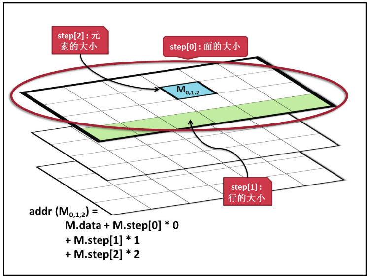

# Mat类详解

#### 目录

[TOC]

## 一、属性

1. **矩阵的结构**：rows × rows × channels，矩阵一个的元素是指包含所有channels的，而不是指一个通道，所以有rows × rows个元素。因此注意区分通道和元素
2. **data** - uchar型的指针。Mat类分为了两个部分:矩阵头和指向矩阵数据部分的指针，data就是指向矩阵数据的指针。

3. **dims** - 矩阵的维度，例如5*6矩阵是二维矩阵，则dims=2，三维矩阵dims=3.

4. **rows** - 矩阵的行数

5. **cols** - 矩阵的列数

6. **size** - 维矩阵的大小，size(cols,rows)注意顺序,如果矩阵的维数大于2，则是size(-1,-1)

7. **channels** - 矩阵元素拥有的通道数，例如常见的彩色图像，每一个像素由RGB三部分组成，则channels = 3

**下面的几个属性是和Mat中元素的数据类型相关的：**

8. **type** - 表示了矩阵中元素类型：包括通道数据类型+通道个数，它是一系列的预定义的常量，其命名规则为`CV_(位数）+（数据类型）+（通道数）`。具体的有以下值： 

   | CV_8UC1  | CV_8UC2  | CV_8UC3  | CV_8UC4  |
   | -------- | -------- | -------- | -------- |
   | CV_8SC1  | CV_8SC2  | CV_8SC3  | CV_8SC4  |
   | CV_16UC1 | CV_16UC2 | CV_16UC3 | CV_16UC4 |
   | CV_16SC1 | CV_16SC2 | CV_16SC3 | CV_16SC4 |
   | CV_32SC1 | CV_32SC2 | CV_32SC3 | CV_32SC4 |
   | CV_32FC1 | CV_32FC2 | CV_32FC3 | CV_32FC4 |
   | CV_64FC1 | CV_64FC2 | CV_64FC3 | CV_64FC4 |

   这里U（unsigned integer）表示的是无符号整数，S（signed integer）是有符号整数，F（float）是浮点数。 

   例如：CV_16UC2，表示的是元素类型是一个16位的无符号整数，通道为2. 

   C1，C2，C3，C4则表示通道是1,2,3,4 type一般是在创建Mat对象时设定，**如果要取得Mat的元素数据类型，则无需使用type，使用下面的depth**。

9. **depth** - 矩阵中一个通道的数据类型，这个值和type是相关的。例如 type为 CV_16SC2，那么depth则是CV_16S。depth也是一系列的预定义值，将type的预定义值去掉通道信息就是depth值: 

   CV_8U， CV_8S， CV_16U， CV_16S， CV_32S， CV_32F， CV_64F

10. **elemSize** - 矩阵一个元素占用的字节数**，**例如：type是CV_16SC3，那么elemSize = 3 * 16 / 8 = 6 bytes

11. **elemSize1** - 矩阵元素一个通道占用的字节数，例如：type是CV_16CS3，那么elemSize1 = 16  / 8 = 2 bytes = elemSize / channels

    下面是一个示例程序，具体说明Mat的各个属性：

    ```cpp
    Mat img(3, 4, CV_16UC4, Scalar_<uchar>(1, 2, 3, 4));    
        cout << img << endl;
        cout << "dims:" << img.dims << endl;
        cout << "rows:" << img.rows << endl;
        cout << "cols:" << img.cols << endl;
        cout << "channels:" << img.channels() << endl;
        cout << "type:" << img.type() << endl;  // type = 26
        cout << "depth:" << img.depth() << endl;  // depth = 2
        cout << "elemSize:" << img.elemSize() << endl;
        cout << "elemSize1:" << img.elemSize1() << endl;
    ```

12. **step** - step[0]是矩阵中一行元素的字节数。

    step[1]是矩阵中一个元素的字节数，也就是和上面所说的elemSize相等。

    上面说到，Mat中一个uchar* data指向矩阵数据的首地址，而现在又知道了每一行和每一个元素的数据大小，就可以快速的访问Mat中的任意元素了。下面公式：

    ```cpp
    addr(M_{i,j}) = M.data + M.step[0]*i + M.step[1]*j
    ```

    **如果数组维度>2维**，如2*3*4，则step[0]是3*4个元素的字节数，step[1]是4个元素的字节数，step[2]是1个元素的字节数

    

13. **step1** - 规整化的step，值为step / elemSize1。 也就是将衡量step的单位变成了通道数。仍以上例代码中定义的img为例，来看下step,step1具体的值：

    ```cpp
    step[0]:32
    step[1]:8
    step1[0]:16
    step1[1]:4
    ```

    img（3*4）的type是CV_16UC4,step[0]是其一行所占的数据字节数4 *4 * 16 / 8  = 32. 

    step[1] 是一个元素所占的字节数，img的一个元素具有4个通道，故：4 * 16 / 8 = 2 

    step1 = step / elemSize1，elemSize1是元素的每个通道所占的字节数。

[回到目录](#目录)

## 二、深拷贝和浅拷贝

### 1. 拷贝方式

为了使程序效率提高，opencv支持两种**拷贝方式**：

- 浅拷贝 - 不复制数据只创建矩阵头，数据共享
- 深拷贝 - 在内存中申请新的空间，整体拷贝

### 2. 常见的拷贝函数

+ 浅拷贝：属于拷贝构造函数，赋值运算符`=`
+ 完全的深拷贝：`clone()`，Mat B = A.clone()，总会在内存中申请新的空间，与Ａ独立
+ 深拷贝：`copyTo()`， A.copyTo(B)，但是否申请新的内存空间，取决于B矩阵的大小信息是否与A一至，若一致则只深拷贝并不申请新的空间，否则先申请空间后再进行拷贝。

### 3. 引用计数系统

因为浅拷贝机制，每个mat对象都有独立的头部，但是可能与其他对象共享同一块数据，因此每个对象都可以看成是数据的一个引用。

那么问题来了，应该由哪个对象负责清理数据。回答是：最后一个使用它的对象。

这通过引用计数的机制实现，每当有人复制Mat对象的头，矩阵的计数器被增加。每当一个头被清除，此计数器被减小。当该计数器变为零，矩阵也就被释放了。

[回到目录](#目录)

## 三、创建矩阵

### 1. 构造函数

（1）用`int*`指定每一维度长度

```cpp
int size[3] = {2,2,2};
Mat A(3, size, CV_8UC1, Scalar::all(0) );//维数，每一维的长度，类型，Scalar::all(0)都初始化成0
```

（2）用`int`指定每一维长度，及元素类型

```cpp
Mat M(2, 2, CV_8UC3, Scalar(0,0,255));//每个元素初始化成（0,0,225）
输出结果：
M = 
    [0, 0, 225,  0, 0, 225;
     0, 0, 225,  0, 0, 225]
```

（3）用Size类型指定形状

```cpp
Mat A(Size s , int type);
```

### 2. create()函数

会对没有适当大小和类型的目标数组分配新的空间，并将分配的数据的引用计数设置为 1。所有数据初始化为0。

```cpp
void Mat::create(int rows, int cols, int type)
void Mat::create(Size size, int type)
void Mat::create(int ndims, const int* sizes, int type)
参数：
ndims – 新数组的维数。
rows – 新的行数。
cols – 新的列数。
size – 替代新矩阵大小规格：`Size(cols, rows)`。
sizes – 指定一个新的阵列形状的整数数组。
type – 新矩阵的类型。
```

### 3. 赋值运算符`=`

若矩阵一开始非空，则会在给矩阵赋新数据之前先由Mat::release()释放引用。

```cpp
Mat& Mat::operator=(const Mat& m)  //只复制头部 A = B
Mat& Mat::operator=(const MatExpr_Base& expr)
Mat& Mat::operator=(const Scalar& s)  //A = s,为每个元素赋值为 s
```

### 4. clone()函数

创建一个数组及其基础数据的完整副本。

```cpp
Mat Mat::clone() const
```

### 5. copyTo()函数

把矩阵复制到另一个矩阵中。

```cpp
void Mat::copyTo(OutputArray m) const 
void Mat::copyTo(OutputArray m, InputArray mask) const 
参数：
m – 目标矩阵。如果它的尺寸和类型不正确，在操作之前会重新分配。
mask – 操作掩码。它的非零元素表示矩阵中某个要被复制，0元素对应的m元素将不会被复制。
```

该方法把矩阵的复制到另一个新的矩阵中在复制之前该方法会调用`m.create(this->size(), this->type);`，因此，目标矩阵会在与源矩阵大小类型不同的情况下重新分配。

### 6. zeros()、ones()、eye()

```cpp
static MatExpr Mat::zeros(int rows, int cols, int type)
static MatExpr Mat::zeros(Size size, int type)
static MatExpr Mat::zeros(int ndims, const int* sizes, int type)//eye没有这种
例1：
A = Mat::zeros （3，3，CV_32F）；
//只要A不是 3 x 3浮点矩阵它就会被分配新的矩阵。否则为现有的矩阵A填充零。
例2：
A = Mat::ones (100，100，CV_8U) * 3 ； // 使100 x 100 矩阵里充满 3。
//上述操作不会形成一个 100 x 100 1 的矩阵，然后乘以 3。
//相反，为了加快效率它只是记住缩放因子（在本例中 3）在实际调用矩阵初始值设定项时使用它。
```

[回到目录](#目录)

## 四、数学运算

```cpp
Mat I, img, I1 , I2 , dst , A , B;
double k, alpha;
Scalar s;
```

### 1. 加法

```cpp
I = I1 + I2;   //== add(I1,I2,I);
add(I1, I2, dst, mask, dtype);
scaleAdd(I1, scale, I2, dst);   // dst = scale*I1+I2;
```

### 2. 减法

```cpp
A-B; A-s; s-A; -A;
absdiff(I1, I2, I);   // I=|I1-I2|;
subtract(I1, I2, dst);
```

### 3. 乘法

（1）数乘

```cpp
I = I1*3 //I1中每个数值都乘以3
Mat A = Mat::ones(2,3,CV_32FC3);
Mat AB;
A.at<Vec3f>(0,0)={1,1,1};A.at<Vec3f>(0,1)={2,2,2};
A.at<Vec3f>(0,2)={3,3,3};A.at<Vec3f>(1,0)={3,3,3};
A.at<Vec3f>(1,1)={3,3,3};A.at<Vec3f>(1,2)={3,3,3};
AB = 2*A;
cout<<AB<<endl;
```

（2）数组乘法

```cpp
I = I1.mul(I2);   //matlab数组乘,I.mul(I,3);–>I=3*I.^2
Mat C = A.mul(5/B);  //==divide(A,B,C,5) == matlab中C=A./B*5
```

（3）矩阵乘法

```cpp
I=I1*I2; 
```

（4）向量乘法

```cpp
Mat::cross(Mat);      //三维向量(或矩阵)的叉乘,A.cross(B)
double Mat::dot(Mat); //2个向量(或矩阵)的点乘的结果,A.dot(B)，若是多通道，则分别点乘再相加
```

### 4. 除法

```cpp
divide(I1, I2, dst, scale, int dtype=-1); //dst=saturate_cast(I1*scale/I2);
A/B; alpha/A; // 都是点除,即数组除法
```

### 5. 开根号 / exp / 对数

```cpp
sqrt(I,dst); exp(I,dst); log(I,dst)
```

### 6. 行列式

```cpp
double determinant(Mat);//行列式
```

### 7. 比较大小

```cpp
A cmpop B;  A compop alpha;  alpha cmpop A;
//这里cmpop表示>,>=,==,!=,<=,<等，结果是CV_8UC1的mask的0或255
```

### 8. 统计

（1）（各通道分别）求和、求平均

```cpp
Scalar s=sum(I); Scalar m=mean(I); 
```

（2）求最值

```cpp
min(A,B);min(A,alpha)//返回dst和A类型一样 
```

（3）随机数

```cpp
randn(I,Mat mean,Mat stddev); randu(I,low,high);  //均匀分布
randu(I,Scalar::all(0),Scalar::all(255));//用随机数填充I，范围是0~255 
```

（4）统计非零的元素个数(总rows*cols个)

```cpp
countNonZero 
```

（5）返回元素总数

```cpp
size_t Mat::total() const
```

### 9. 转换

（1）类型转换

```cpp
(1)用元素类型
void Mat::convertTo(OutputArray m,int rtype,
                    double alpha=1,double beta=0)const
I.convertTo(I1,CV_32F);//例如
(2)用通道类型（depth）
void Mat::assignTo(Mat& m, int type=-1 ) const
//m – 目标阵列。
//type – 目标阵列depth或－１（如果阵列的类型和源矩阵类型相同）     
```

（2）设置值：将阵列中所有的或部分的元素设置为指定的值。

```cpp
C++: Mat& Mat::setTo(const Scalar& s, InputArray mask=noArray())
//s – 把标量赋给阵列并转化到阵列的实际类型。
//mask – 与 *this尺寸相同的操作掩码。这是Mat::operator=(const Scalar& s)运算符的一个高级变量。
```

（3）矩阵的逆

```cpp
MatExpr Mat::inv(int method=DECOMP_LU) const
//method – 反转矩阵的方法。有以下几种可能的值：
– DECOMP_LU是 LU 分解一定不能是奇异的。
– DECOMP_CHOLESKY 是 Cholesky LLT只适用于对称正矩阵的分解。该类型在处理大的矩阵时的速度是LU的两倍左右。
– DECOMP_SVD是 SVD 分解。如果矩阵是奇异或甚至不是2维，函数就会计算伪逆矩阵相当于pinv。同样只返回临时对象
```

（4）翻转

```cpp
flip(I,dst,int flipCode);
//flipCode=0是上下翻转，>0时左右翻转,<0时一起来
```

（5）改变形状或通道数（不复制数据）

```cpp
Mat Mat::reshape(int cn, int rows=0) const
//参数：
cn – 新的通道数。若cn=0，那么通道数就保持不变。
rows –新的行数。 若rows = 0, 那么行数保持不变。
```

（6）改变行数：在原来矩阵下添加几行

```cpp
void Mat::resize(size_t sz)
void Mat::resize(size_t sz, const Scalar& s)
//参数
sz –新的行数。
s –分配给新添加的元素的值。
```

（！非Mat成员函数，作为补充）改变图像大小resize（分配空间，进行插值）

```cpp
void resize(InputArray src, OutputArray dst, Size dsize, 
            double fx=0, double fy=0, 
            int nterpolation=INTER_LINEAR )
前两个参数分别为输入和输出图像。dsize表示输出图像的大小，如果为0，则：
    dsize=Size(round(fx∗src.cols),round(fy∗src.rows))
dsize和fx、fy不能同时为0。fx、fy是沿x轴和y轴的缩放系数；默认取0时，计算如下
    fx=(double)dsize.width/src.cols
    fy=(double)dsize.height/src.rows
最优一个参数interpolation表示插值方式，有以下几种：
    INTER_NEAREST - 最近邻插值
    INTER_LINEAR - 线性插值（默认）
    INTER_AREA - 区域插值
    INTER_CUBIC - 三次样条插值
    INTER_LANCZOS4 - Lanczos插值    
```

[回到目录](#目录)

## 五、子矩阵

### 1. row，col

```cpp
Mat Mat::row(int i) const  // i是0基的索引 
//例子： 
inline void matrix_axpy(Mat& A, int i, int j, double alpha){
    A.row(i) += A.row(j)*alpha; } 
```

注意，本函数返回的只是矩阵头，而赋值操作也只是赋值矩阵头，因此：

```cpp
Mat A ;  A.row(i) = A.row(j) ； 
```

不能将数据改变，发生这种情况是因为` A.row(i)` 形成临时矩阵头进一步分配给另一个矩阵头。

可以改成：

```cpp
A.row(i) = A.row(j) + 0;// 可行，但看上去有点目的不明确。 
A.row(j).copyTo(A.row(i)) ;// 这是有点儿长，但这是推荐的方法。
```

### 2. rowRange，colRange

与row和col类似，为指定的行或列区间创建一个新的矩阵头。

```cpp
Mat Mat::rowRange(int startrow, int endrow) const
Mat Mat::rowRange(const Range& r) const
//参数：
startrow – 一个包容性的0基（从0开始）的起始索引。
endrow – 一个独占性0基的终止索引（不包含endrow）。
r – Range 结构包含着起始和终止的索引值。该方法给矩阵指定的行span创建了新的头。
```

### 3. 取ROI（注意Rect是先列再行）

```cpp
ROI1=image1(Rect(500,250,cols,rows)) //左上角位置+列行
ROI2=image1(Range(250,250+rows),Range(200,200+cols));//切片
//若要选所有行请用Range::all()
```

### 4. 调整子阵在父矩阵中的边缘位置

```cpp
Mat& Mat::adjustROI(int dtop, int dbottom,int dleft, int dright)
//参数
    dtop –顶部子阵边界向上的平移量。
    dbottom –底部子阵边界向下的平移量。
    dleft –左子阵边界向左的平移量。
    dright –右子阵边界向右的平移量。
```

[回到目录](#目录)

## 六、属性获取

### 1. 元素大小（字节单位）

```cpp
A.elemSize();
//单个通道大小
A.elemSize1();
```

### 2. 元素类型

```cpp
A.type();
//元素深度（通道类型）
A.depth();
```

### 3. 通道数目

```cpp
A.channels();
```

### 4. step和step1

```cpp
A.step();  A.step1();
```

### 5. 二维数组的size

```cpp
 Size Mat::size() const
 //Size(cols, rows)。矩阵超过 2 维时返回大小为（-1，-1）。
```

### 6. 判断矩阵是否为空

```cpp
bool Mat::empty() const ; //空则为true
```

### 7. 元素访问

（1）Mat.data 是指向数据的uchar型指针

（2）Mat::ptr

返回指定矩阵行的uchar（默认），或**指定类型**的'指针'。

```cpp
（1）一维：
uchar* Mat::ptr(int i=0)   // return  data + step.p[0] * i
template<typename _Tp> _Tp* Mat::ptr(int i=0)   // return (_Tp*)(data + step.p[0] * y)
（2）二维：
uchar* Mat::ptr(int x, int y)  //返回 data + x * step.p[0] + y * step.p[1];
template<typename _Tp> _Tp* Mat::ptr(int x,int y)  //返回 data + x * step.p[0] + y * step.p[1];
（3）使用：
mat.ptr(0) //返回第一行，第一个字节的指针
mat.ptr<Vect3b>(0) //元素是CV_8UC3,则返回第一个元素的指针
mat.ptr(x)[y]   //就是指向mat的第x行的第==y+1==个数据，数据类型为无符号的短整型。
mat.ptr(x,y) //
（4）可用的索引类型：
   int/int[]
```

（3）Mat::at

与ptr类似，不同的是：返回对指定数组元素的**引用**，而且可以用Point，vector类型做参数

```cpp
return ((const _Tp*)(data + step.p[0] * x))[y];
可以用作索引的类型：
int / int[] / Point / vector
```

[回到目录](#目录)

## 七、打印格式

调用format(Mat , "参数" )

```cpp
cout << format(R,"python") << endl 
cout << format(R,"numpy" ) << endl
```

