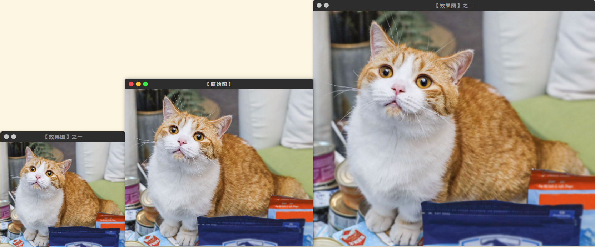

# OpenCV图像金字塔

#### 目录

[TOC]

## 一、图像金字塔概述

### 1. 基本概念

图像金字塔最初用于机器视觉和图像压缩，一幅图像的金字塔是一系列以倒金字塔形状排列的分辨率逐步降低，且来源于同一张原始图的图像集合。金字塔的底部是待处理图像的高分辨率表示，而顶部是低分辨率的近似。我们将一层一层的图像比喻成金字塔，层级越高，则图像越小，分辨率越低。


### 2. 分类

**高斯金字塔**（Gussianpyramid）：用来下采样(缩小图像)，主要的图像金字塔。

**拉普拉斯金字塔**（Laplacianpyramid）：用来上采样(放大图像)。在数字图像处理中也即是预测残差，可以对图像进行最大程度的还原，配合高斯金字塔一起使用。

图像金字塔中的向上和向下采样分别通过OpenCv函数`pyrUp`和`pyrDown`实现。

#### 2.1高斯金字塔（缩小图像）

（1）为了从$G_i$（表示第i层高斯金字塔）获取层级$G_{i+1}$进行高斯内核卷积；

（2）将所有偶数行和列去除；

得到的图像即为i+1层的图像，显而易见，结果图像只有原始图像的四分之一。通过对图像i层的不停迭代以上步骤就可以得到整个金字塔。同时可以发现，向下取样会逐渐丢失图像的信息。

#### 2.2拉普拉斯金字塔（放大图像）

（1）将图像在每个方向扩大为原来的两倍，新增的行和列以0填充；

（2）使用先前同样的高斯内核（乘以四）与放大后的图像卷积，获得“新增像素”的值

得到的图像即为放大后的图像，但是与原来图像相比发现会比较模糊，因为在缩放的过程中已经丢失了一些信息，这些丢失的数据形成了拉普拉斯金字塔。

也就是说，拉普拉斯金字塔是通过源图像减去先缩小后放大的图像的一些图像构成的。用公式表示，拉普拉斯金字塔第i层为：
$$
L_i=G_i-pryUp(G_{i+1})
$$

[回到目录](#目录)

## 二、OpenCV实现

### 1. 调整图像大小`resize()`

`resize( )`为OpenCV中专职调整图像大小的函数。

```c++
void resize(InputArray src, OutputArray dst, Size dsize, 
            double fx=0, double fy=0, int interpolation=INTER_LINEAR )
```

- dsize，Size类型，输出图像的大小；如果它等于零，即填入`Size()`,则由下式进行计算：  $dsize=Size(round(fx\times src.cols),round(fy\times src.rows))$

- fx，double类型，沿水平轴的缩放系数，有默认值0，且当其等于0时，由下式进行计算：$(double)dsize.width/src.cols$

- fy，double类型，沿水平轴的缩放系数，有默认值0，且当其等于0时，由下式进行计算：$(double)dsize.height/src.rows$

- interpolation，int类型，用于指定插值方式，默认为INTER_LINEAR（线性插值）。可选的插值方式有：

  * INTER_NEAREST - 最近邻插值
  * INTER_LINEAR - 线性插值（默认值）
  * INTER_AREA - 区域插值（利用像素区域关系的重采样插值）
  * INTER_CUBIC –三次样条插值（超过4×4像素邻域内的双三次插值）
  * INTER_LANCZOS4 -Lanczos插值（超过8×8像素邻域的Lanczos插值）

> **tips**：若要缩小图像，最好用CV_INTER_AREA来插值，若要放大图像，一般情况下最好用CV_INTER_CUBIC（效率不高，慢，不推荐使用）或CV_INTER_LINEAR（效率较高，速度较快，推荐使用）。

`resize()`函数使用效果如下图：



[resize参考代码](<https://github.com/Liuyvjin/OpenCV_begin/tree/master/EX8/myResize.cpp>)

### 2. 向上采样放大 `pyrUp()`

`pyrUp()`函数的作用是向上采样并模糊一张图像，说白了就是放大一张图片。

```cpp
void pyrUp(InputArray src, OutputArraydst, 
           const Size& dstsize=Size(), 
           int borderType=BORDER_DEFAULT )
```

- dstsize，const Size&类型，输出图像的大小；有默认值Size()，即默认情况下，由Size（src.cols×2，src.rows×2）来进行计算，一直需要满足下列条件：

$$
|dstsize.width-src.cols*2|\le(dstsize.width\mod 2)\\
|dstsize.height-src.rows*2|\le(dstsize.height\mod 2)
$$

### 3. 向下采样缩小 `pyrDown()`

pyrDown()函数的作用是向下采样并模糊一张图片，说白了就是缩小一张图片。

```cpp
void pyrDown(InputArray src, OutputArray dst, 
             const Size& dstsize=Size(), 
             int borderType=BORDER_DEFAULT);
```

- dstsize，const Size&类型，输出图像的大小;有默认值Size()，即默认情况下，由Size Size((src.cols+1)/2, (src.rows+1)/2)来进行计算，且一直需要满足下列条件：
  $$
  |dstsize.width*2-src.cols|\le 2\\
  |dstsize.height*2-src.rows|\le 2
  $$
  

[参考代码](<https://github.com/Liuyvjin/OpenCV_begin/tree/master/EX8/comprehensive.cpp>)

[回到目录](#目录)

