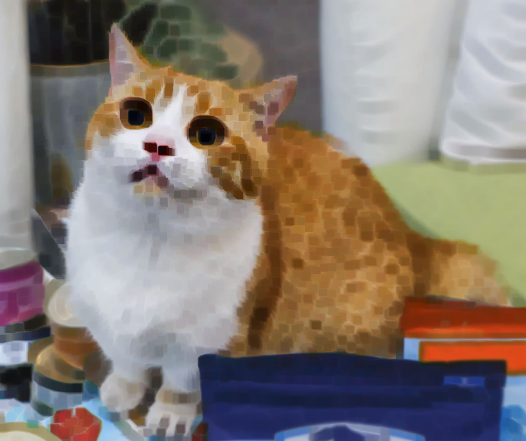

# OpenCV形态学图像处理

#### 目录

[TOC]

## 一、膨胀与腐蚀

### 1. 膨胀 dilate

与中值滤波类似的操作，但不是取视界内的中值，而是取**视界内的极大值**作为输出。这样会使得图像中的高亮部分得到扩大。

下面来看一下膨胀的效果：

<figure class="half">
     
    
</figure>

OpenCV函数：

```cpp
C++: void dilate(InputArray src, OutputArray dst, InputArray kernel,
                 Point anchor=Point(-1,-1), int iterations=1,
                 int borderType=BORDER_CONSTANT,
                 const Scalar& borderValue=morphologyDefaultBorderValue());
```

* src，InputArray类型，输入图像，图像通道的数量可以是任意的，但图像深度应为CV_8U，CV_16U，CV_16S，CV_32F或 CV_64F其中之一。
* dst，OutputArray类型，目标图像，需要和源图片有一样的尺寸和类型。
* kernel，InputArray类型，膨胀操作的核。若为NULL时，表示的是使用参考点位于中心3x3的核。

> 使用函数 **getStructuringElement**配合这个参数的使用。该函数会返回指定形状和尺寸的结构元素（内核矩阵）。
>
> ```cpp
> int size = 3; 
> // 获取自定义核
> Mat element = getStructuringElement( MORPH_RECT,
> 				Size(2*size+1,2*size+1),
> 				Point( size, size ));
> ```
>
>
> * 第一个参数表示内核的形状，我们可以选择如下三种形状之一：矩形: `MORPH_RECT`；交叉形: `MORPH_CROSS`；
>   椭圆形: `MORPH_ELLIPSE`
> * 第二个参数表示内核的尺寸，Size类型。
> * 第三个参数表示锚点的位置，Point类型。有默认值Point(-1,-1)，表示锚点位于中心。且需要注意，十字形的element形状唯一依赖于锚点的位置。而在其他情况下，锚点只是影响了形态学运算结果的偏移。

* anchor，Point类型，锚的位置，其有默认值（-1，-1），表示锚位于中心。
* iterations，int类型，迭代使用函数的次数，默认值为1。
* borderType，int类型，用于推断图像外部像素的某种边界模式。注意它有默认值BORDER_DEFAULT。
* borderValue，const Scalar&类型，当边界为常数时的边界值，有默认值morphologyDefaultBorderValue()，一般我们不用去管他。需要用到它时，可以看官方文档中的createMorphologyFilter()函数得到更详细的解释。

### 2. 腐蚀 erode

取**视界内的最小值**作为核函数的输出。这样会使得图像中的高亮部分收缩。

下图是腐蚀的效果：

<figure class="half">
     
    
</figure>

OpenCV函数：

```cpp
C++: void erode(InputArray src, OutputArray dst, InputArray kernel,
                 Point anchor=Point(-1,-1), int iterations=1,
                 int borderType=BORDER_CONSTANT,
                 const Scalar& borderValue=morphologyDefaultBorderValue());
```

参数同dilate。

[回到目录](#目录)

[膨胀与腐蚀代码](<https://github.com/Liuyvjin/OpenCV_begin/tree/master/EX5>)

## 二、开运算和闭运算

### 1. 开运算

（1）概念：**开运算 = 先腐蚀，再膨胀**。过程示意图如下。**注意**不能将图中黑色区域理解为低光区，而应该理解为作用对象区（即开运算可以看做是针对这个对象的），白色区域为背景区。而在OpenCV中默认作用对象是高光区。


（2）特点：

* 开运算是一个基于几何运算的滤波器。能够除去作用对象上孤立的小点，毛刺和小桥，而总的位置和形状不变。 
* 核的大小和形状将会影响滤波效果，导致不同的分割，即提取出不同的特征。

### 2. 闭运算

（1）概念：闭运算与开运算相反。闭运算=先膨胀，再腐蚀。


（2）特点：

* 闭运算能够填平小孔，弥合小裂缝，而总的位置和形状不变。 
* 结构元素（核）大小的不同将导致滤波效果的不同。 
  不同形状核的选择会导致不同的分割。

## 三、形态学梯度，顶帽，黑帽

### 1. 形态学梯度

（1）概念：**膨胀图与腐蚀图之差。**

（2）特点：

* 形态学梯度操作的输出像素值是在对应结构元素区域中灰度级的最大值减去最小值。 
* 对二值图像进行形态学操作可以将**团块**(blob，就是目标对象去除毛刺，细桥剩下的部分)**的边缘**突出出来,可以用形态学梯度来保留物体的边缘轮廓。

### 2. 顶帽（Top Hat）

（1）概念：**原图与开运算之差**。开运算去掉了目标对象区的小桥，毛刺等，顶帽操作就是获得这些被去掉这些小桥，毛刺。

### 3. 黑帽（Black Hat）

（1）概念：**闭运算与原图之差**。

### 4. OpenCV实现  morphologyEx

```cpp
void morphologyEx( InputArray _src,OutputArray _dst, int op,
                  InputArray kernel, Point anchor, int iterations,
                  int borderType, constScalar& borderValue )
```

* src，输入图像，图像位深应该为以下五种之一：CV_8U, CV_16U,CV_16S, CV_32F 或CV_64F。
* dst，目标图像，要和源图片有一样的尺寸和类型。
* op，int类型，表示形态学运算的类型，可以是如下之一的标识符：
  * MORPH_OPEN – 开运算（Opening operation）
  * MORPH_CLOSE – 闭运算（Closing operation）
  * MORPH_GRADIENT -形态学梯度（Morphological gradient）
  * MORPH_TOPHAT - “顶帽”（“Top hat”）
  * MORPH_BLACKHAT - “黑帽”（“Black hat“）
  * MORPH_ERODE - “腐蚀”
  * MORPH_DILATE - “膨胀”

* kernel，InputArray类型的，形态学运算的内核。若为NULL时，默认使用参考点位于中心3x3的核。
* anchor，Point类型，锚的位置，其有默认值（-1，-1），表示锚位于中心。
* iterations，int类型，迭代使用函数的次数，默认值为1。
  

使用morphologyEx()函数，一般我们只需要填前面的四个参数，后面的四个参数都有默认值。


