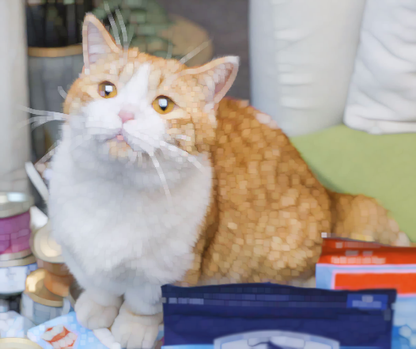

# OpenCV形态学图像处理

#### 目录

[TOC]

## 一、膨胀与腐蚀

### 1. 膨胀 dilate

与中值滤波类似的操作，但不是取视界内的中值，而是取**视界内的极大值**作为输出。这样会使得图像中的高亮部分得到扩大。

下面来看一下膨胀的效果：

<figure class="half">
     
    
</figure>

OpenCV函数：

```cpp
C++: void dilate(InputArray src, OutputArray dst, InputArray kernel,
                 Point anchor=Point(-1,-1), int iterations=1,
                 int borderType=BORDER_CONSTANT,
                 const Scalar& borderValue=morphologyDefaultBorderValue());
```

* src，InputArray类型，输入图像，图像通道的数量可以是任意的，但图像深度应为CV_8U，CV_16U，CV_16S，CV_32F或 CV_64F其中之一。
* dst，OutputArray类型，目标图像，需要和源图片有一样的尺寸和类型。
* kernel，InputArray类型，膨胀操作的核。若为NULL时，表示的是使用参考点位于中心3x3的核。

> 使用函数 **getStructuringElement**配合这个参数的使用。该函数会返回指定形状和尺寸的结构元素（内核矩阵）。
>
> ```cpp
> int size = 3; 
> // 获取自定义核
> Mat element = getStructuringElement( MORPH_RECT,
> 				Size(2*size+1,2*size+1),
> 				Point( size, size ));
> ```
>
>
> * 第一个参数表示内核的形状，我们可以选择如下三种形状之一：矩形: `MORPH_RECT`；交叉形: `MORPH_CROSS`；
>   椭圆形: `MORPH_ELLIPSE`
> * 第二个参数表示内核的尺寸，Size类型。
> * 第三个参数表示锚点的位置，Point类型。有默认值Point(-1,-1)，表示锚点位于中心。且需要注意，十字形的element形状唯一依赖于锚点的位置。而在其他情况下，锚点只是影响了形态学运算结果的偏移。

* anchor，Point类型，锚的位置，其有默认值（-1，-1），表示锚位于中心。
* iterations，int类型，迭代使用函数的次数，默认值为1。
* borderType，int类型，用于推断图像外部像素的某种边界模式。注意它有默认值BORDER_DEFAULT。
* borderValue，const Scalar&类型，当边界为常数时的边界值，有默认值morphologyDefaultBorderValue()，一般我们不用去管他。需要用到它时，可以看官方文档中的createMorphologyFilter()函数得到更详细的解释。

### 2. 腐蚀 erode

取**视界内的最小值**作为核函数的输出。这样会使得图像中的高亮部分收缩。

下图是腐蚀的效果：

<figure class="half">
     
    
</figure>

OpenCV函数：

```cpp
C++: void erode(InputArray src, OutputArray dst, InputArray kernel,
                 Point anchor=Point(-1,-1), int iterations=1,
                 int borderType=BORDER_CONSTANT,
                 const Scalar& borderValue=morphologyDefaultBorderValue());
```

参数同dilate。

[回到目录](#目录)

[膨胀与腐蚀代码](<https://github.com/Liuyvjin/OpenCV_begin/tree/master/EX5>)

## 二. 

