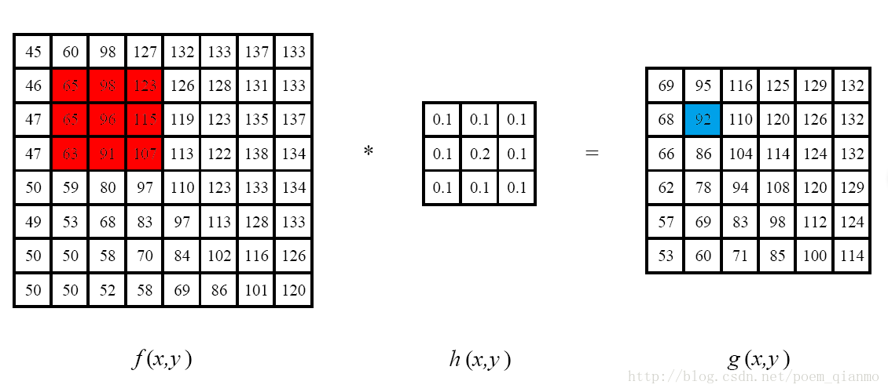

# OpenCV滤波

#### 目录

[TOC]

## 一、线性临域滤波（卷积）

> **滤波和模糊的联系与区别**：
>
> **滤波**就是高通滤波或者低通滤波等改变输入信号频率分布的操作；**模糊**就是低通滤波，**锐化**就是高通滤波。

### 1. 线性临域滤波的概念

**临域算子**是利用给定像素临域内的全体像素决定此像素的输出值的一种函数操作。

**线性临域算子**是一种特殊的临域算子，它对临域内像素进行线性操作。例如下图，将红色临域内像素与$h(x,y)$进行点乘输出为蓝色方块，就是线性临域操作：



显然经过这个操作，图像的长宽各减小了2像素。

像这样的$h(x,y)$称作**滤波器**，或者**核**

### 2. 方框滤波 boxFilter

```cpp
C++: void boxFilter(InputArray src,OutputArray dst, int ddepth, 
                    Size ksize, Point anchor=Point(-1,-1),
                    boolnormalize=true, int borderType=BORDER_DEFAULT )
```

+ src，InputArray类型，输入图像，填Mat类的对象即可。该函数对通道是独立处理的，且可以处理任意通道数的图片，但需要注意，待处理的图片深度应该为CV_8U, CV_16U, CV_16S, CV_32F 以及 CV_64F之一。
+ dst，OutputArray类型，即目标图像，需要和源图片有一样的尺寸和类型。
+ ddepth，int类型，输出图像的深度，-1代表使用原图深度，即src.depth()。
+ ksize，Size类型，内核的大小。一般这样写Size(w, h)来表示内核的大小( 其中，w 为像素宽度， h为像素高度)。
+ anchor，Point类型，表示锚点（即被核中对应被平滑的那个点），注意有默认值Point(-1,-1)。如果这个点坐标是负值的话，就表示取核的中心为锚点，所以默认值表示这个锚点在核的中心。
+ normalize，bool类型，默认值为true，一个标识符，表示内核是否归一化（normalized），也即取平均值。后面有介绍。
+ borderType，int类型，由于卷积无法触及边缘，所以需要添加边缘，该参数指定了添加边缘的方法。有默认值BORDER_DEFAULT，我们一般不去管它。

方框滤波一般所用的核为：
$$
\mathbf{K}=\alpha
\begin{bmatrix}
1&1&\cdots&1\\
1&1&\cdots&1\\
\vdots&\vdots&\ddots&\vdots\\
1&1&\cdots&1
\end{bmatrix}
$$
其中：
$$
\alpha=
\begin{cases}
1\over K.width\times K.height&,normalize=ture\\
1&,normalize=false
\end{cases}
$$
可见，当$normalize=ture$时，方框滤波就是均值滤波。

### 3. 均值滤波 blur

均值滤波就是对视界内所有的像素取均值作为输出值。这种方法存在固有缺陷，即不能很好保护图像的细节，使得图像变模糊。

在OpenCV中可以使用函数 `blur` 实现均值滤波：

```cpp
void blur(InputArray src, OutputArray dst, Size ksize, 
          Point anchor=Point(-1,-1), int borderType=BORDER_DEFAULT )
```

参数同 `boxFilter()`。

### 4. 高斯滤波 GaussianBlur

**高斯滤波**即核函数服从高斯分布的线性滤波。它对服从高斯分布的噪声非常有效。

由于高斯函数的傅里叶变换还是高斯函数，因此它的频谱是关于y轴对称的，在x正半轴是不断衰减的。而线性滤波操作实际上是核函数与图像之间的**卷积**，也就是频域的**乘积**，因此高斯滤波相当于是一个**低通滤波器**。

一个典型的高斯滤波核函数如下图所示：


从直观上来看，它**与均值滤波的区别**就是：越靠近视界中心的像素点对输出像素的影响越大。

在OpenCV中可以这样使用高斯滤波：

```cpp
void GaussianBlur(InputArray src,OutputArray dst, Size ksize, 
                  double sigmaX, double sigmaY=0,
                  intborderType=BORDER_DEFAULT )
```

+ ksize，由于对称性，要满足长宽是奇数。**若为（1×1）相当于没有滤波**
+ sigmaX，double类型，表示高斯核函数在X方向的的标准偏差。
+ sigmaY，double类型，表示高斯核函数在Y方向的的标准偏差。若sigmaY为零，就将它设为sigmaX，如果sigmaX和sigmaY都是0，那么就由ksize.width和ksize.height计算出来。

[回到目录](#目录)

[滤波函数—代码](<https://github.com/Liuyvjin/OpenCV_begin/tree/master/EX4>)

## 二、非线性滤波

### 1. 非线性滤波简介

在很多情况下，使用邻域像素的非线性滤波也许会得到更好的效果。比如在噪声是散粒噪声而不是高斯噪声，即图像偶尔会出现很大的值的时候。在这种情况下，用高斯滤波器对图像进行模糊的话，噪声像素是不会被去除的，它们只是转换为更为柔和但仍然可见的散粒。

### 2. 中值滤波

（1）简介：**中值滤波**（Median filter）是一种典型的非线性滤波技术，基本思想是用像素点邻域灰度值的**中值**来代替该像素点的灰度值，该方法在**去除脉冲噪声、椒盐噪声**的同时又能保留图像边缘细节。但是对一些细节多，特别是线、尖顶等细节多的图像不宜采用中值滤波。

 **中值滤波与均值滤波比较的优劣**：在均值滤波中，噪声成分被放入平均值中，因而输出受噪声影响较大。但是中值滤波花费的时间是均值滤波的5倍以上。

（2）OpenCV函数：

```cpp
void medianBlur( InputArray _src0,OutputArray _dst, int ksize )
```

* ksize，视界的尺寸（aperture linear size），注意这个参数必须是大于1的奇数，比如：3，5，7，9 ...

### 3. 双边滤波

（1）简介：**双边滤波**（Bilateral filter），是结合图像的空间邻近度和像素值相似度的一种折衷处理，达到保边去噪的目的。

双边滤波器的**优点**是可以做**边缘保存**（edge preserving），离的较远的像素不会太多影响到边缘上的像素值，这样就保证了边缘附近像素值的保存。但是由于保存了过多的高频信息，对于彩色图像里的高频噪声，双边滤波器不能够干净的滤掉，只能够**对于低频信息进行较好的滤波**。

（2）核函数形式： 与一般线性滤波类似，在双边滤波器中，输出像素的值依赖于邻域像素值的加权值组合，但是权重是与临域内像素值有关的，因此是非线性的。它的**权值形式与高斯滤波很类似。**

* 高斯滤波的权值函数：

$$
h(c_x,c_y,x,y) = exp(-\frac{(x-c_x)^2+(y-c_y)^2}{2\sigma _d^2})
$$
$h(c_x,c_y,x,y)$表示$(c_x,c_y)$临域内，某一点$(x,y)$的对应的权值，所以距离中心点越远的点对应权值越小，对输出值影响也就越小。

* 双边滤波的权值函数：

$$
h(c_x,c_y,x,y) = exp(-\frac{(x-c_x)^2+(y-c_y)^2}{2\sigma _s^2}-\frac{||f(c_x,c_y)-f(x,y)||^2}{2\sigma_c^2})
$$
其中$f(x,y)$表示一点的像素值，因此在考虑位置的前提下，与中心点像素值差距越大的点，对应权值越小，对输出值影响也就越小。

（3）OpenCV函数：

```cpp
void bilateralFilter(InputArray src, OutputArraydst, int d, 
                     double sigmaColor, double sigmaSpace, 
                     int borderType=BORDER_DEFAULT)
```

+ d，int类型，表示在过滤过程中每个像素邻域的直径。如果这个值我们设其为非正数，那么OpenCV会从第五个参数sigmaSpace来计算出它来。
+ sigmaColor，double类型，颜色空间滤波器的sigma值。这个参数的值越大，就表明该像素邻域内有更宽广的颜色会被混合到一起，产生较大的半相等颜色区域。
+ sigmaSpace，double类型，坐标空间的标准方差。数值越大，意味着越远的像素会相互影响，从而使更大的区域获取相似的颜色。当d>0，d指定了邻域大小且与sigmaSpace无关。否则，d正比于sigmaSpace。

[回到目录](#目录)

[滤波函数—代码](<https://github.com/Liuyvjin/OpenCV_begin/tree/master/EX4>)

## 三、自定义卷积

从上面的论述可以看出，滤波实际上就是做卷积。不同的滤波只不过是采用了不同的卷积算子。因此我们也可以自定义内核进行卷积。OpenCV提供了`filter2D`函数来完成这个操作。

```cpp
void filter2D( InputArray src, OutputArray dst, int ddepth,
              InputArray kernel, Point anchor=Point(-1,-1),
              double delta=0, int borderType=BORDER_DEFAULT );
```

* kernel - InputArray类型，卷积用的核，可以用如下方法定义：

  ```cpp
  Mat kernel = (Mat_<char>(3,3) << 0,-1,0,-1,5,-1,0,-1,0);
  Mat kernel = (Mat_<int>(3, 3) << -1, 0, 1, -2, 0, 2, -1, 0, 1); 
  ```

  
