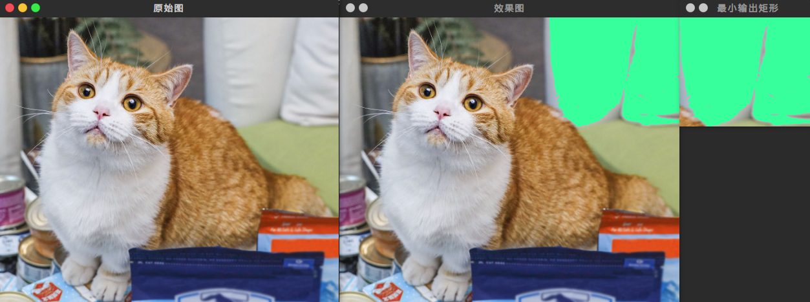

# OpenCV漫水填充

#### 目录

[TOC]

## 一、简介

漫水填充，简单来说就是photoshop里的魔棒工具。选中一个种子点，自动选中与种子点颜色相近的连通区域。

## 二、函数介绍

OpenCV里提供了两个版本的函数。一个不带掩膜mask的版本，和一个带mask的版本。
无掩膜版本
```cpp
int floodFill(InputOutputArray image, Point seedPoint, 
              Scalar newVal,   Rect* rect=0, 
              Scalar loDiff=Scalar(), Scalar upDiff=Scalar(), 
              int flags=4 )
```
有掩膜版本
```cpp
int floodFill(InputOutputArray image, InputOutputArray mask, 
              Point seedPoint,Scalar newVal, Rect* rect=0, 
              Scalar loDiff=Scalar(), Scalar upDiff=Scalar(), 
              int flags=4 )
```

**参数介绍：**第二个版本比第一个版本只多了一个参数mask

* image - InputOutputArray类型, 输入/输出1通道或3通道，8位或浮点图像，具体参数由之后的参数具体指明。

* mask - InputOutputArray类型，这是第二个版本的floodFill独享的参数，表示操作掩模。它应该为**单通道、8位**、长和宽上都比输入图像 image **大两个像素点**的图像。

  **注意**，**漫水填充不会填充掩膜mask的非零像素区域**。例如，一个边缘检测算子的输出可以用来作为掩膜，以防止填充到边缘。同样的，也可以在多次的函数调用中使用同一个掩膜，以保证填充的区域不会重叠。

  **注意**，掩膜mask会比需填充的图像大，所以mask中的(x+1,y+1) 对应 输入图像的(x,y)。

* seedPoint - Point类型，漫水填充算法的起始点，一般填`Point(x,y)`。

* newVal - Scalar类型，像素点被染色的值，即在填充区域像素的新值。

* rect - Rect\*类型，有默认值0，一个可选的参数。用于保存包含重绘区域的最小矩形范围。使用方法是在主程序中如下写，可以显示重绘区域。

  ```cpp
  Rect ccomp;
  floodFill(src,...,&ccomp,...);
  imshow("重绘区域",src(ccomp));
  ```

* loDiff - Scalar类型，有默认值Scalar()，表示以当前观察像素值pixel为基准，(pixel-Scalar,pixel)范围内的像素值可以加入。

* upDiff - Scalar类型，有默认值Scalar()，表示以当前观察像素值pixel为基准，(pixel,pixel+Scalar)范围内的像素值可以加入。

* flags - int类型，操作标志符，此参数包含三个部分，比较复杂，我们一起详细看看:

  * 低八位（第0~7位） - 设置**连通性**，可取4 (4为缺省值) 或者 8。如果设为4，表示填充算法只考虑当前像素水平方向和垂直方向的相邻点；如果设为 8，除上述相邻点外，还会包含对角线方向的相邻点。

  * 高八位（16~23位） - 设置**填充模式**，可以为0或者如下两种选项标识符的组合：  

    `FLOODFILL_FIXED_RANGE` - **填充固定像素范围**。如果设置这个标识符的话，就只考虑当前像素与种子像素之间的差（以一个点为参考，也即固定了像素范围），否则就考虑当前像素与其相邻像素的差。如果不设置这个值，则是浮动像素范围。
    `FLOODFILL_MASK_ONLY` - **只填充掩膜**。如果设置为这个标识符的话，函数不会去填充改变原始图像 (也就是忽略第三个参数newVal), 而是去填充掩模图像（mask）。这个标识符只对第二个版本的floodFill有用。

  * 中间八位（8~15位） - 上面关于高八位FLOODFILL_MASK_ONLY标识符中已经说明，可以只填充掩膜图像，flags参数的中间八位就是用于填充掩码图像的值。但如果flags中间八位的值为0，则掩码会用1来填充。

  * 而所有flags可以用or操作符连接起来，即“|”。例如，如果想用8邻域填充，并填充固定像素值范围，填充掩码而不是填充源图像，以及设填充值为38，那么输入的参数是这样：

    `flags=8 | FLOODFILL_MASK_ONLY | FLOODFILL_FIXED_RANGE | （38<<8）`

* int类型的返回值，是被重绘的点的个数。

## 三、使用效果

使用效果如下：



[参考代码](<https://github.com/Liuyvjin/OpenCV_begin/tree/master/EX10>)

