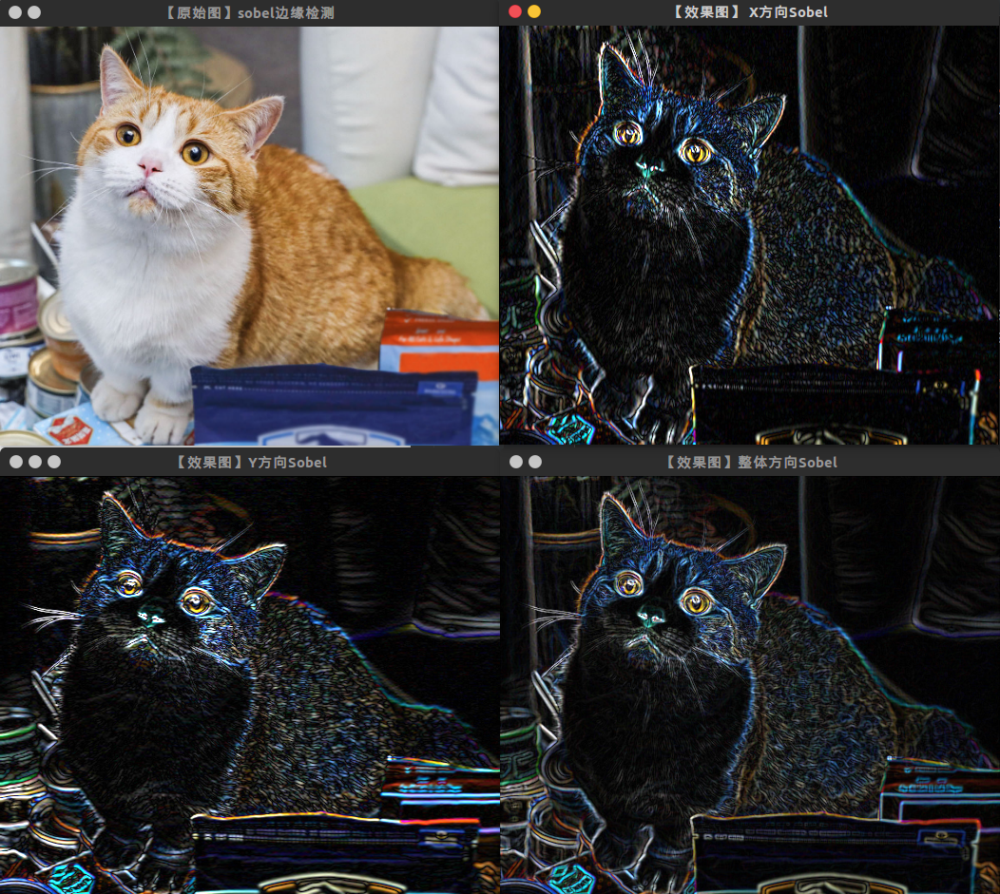

# OpenCV边缘检测

#### 目录

[TOC]

## 一、边缘检测原理

### 1. 原理概述

实现图像的边缘检测，就是要用离散化梯度逼近函数根据二维灰度矩阵梯度向量来寻找图像灰度矩阵的灰度跃变位置，然后在图像中将这些位置的点连起来就构成了所谓的图像边缘。

### 2. 一般步骤

1. 滤波：边缘检测的算法主要是基于图像强度的一阶和二阶导数，但导数通常对噪声很敏感，因此必须采用滤波器来改善性能。常见的滤波方法主要有高斯滤波。
2. 增强：增强边缘的基础是确定图像各点邻域强度的变化值。增强算法可以将图像灰度点邻域强度值有显著变化的点凸显出来。在具体编程实现时，可通过计算梯度幅值来确定。
3. 检测：经过增强的图像，往往邻域中有很多点的梯度值比较大，而在特定的应用中，这些点并不是我们要找的边缘点，所以应该采用某种方法来对这些点进行取舍。实际工程中，常用的方法是通过阈值化方法来检测。

### 3. 边缘检测算法评价

1. 低错误率: 标识出尽可能多的实际边缘，同时尽可能的减少噪声产生的误报
2. 高定位性: 标识出的边缘要与图像中的实际边缘尽可能接近。
3. 最小响应: 图像中的边缘只能标识一次，并且可能存在的图像噪声不应标识为边缘。

## 二、Canny边缘检测

### 1. 步骤 

1. 滤波--消除噪声

   使用高斯平滑滤波器卷积降噪:

$$
K=\frac{1}{139}
\begin{bmatrix}
2&4&5&4&2\\
4&9&12&9&4\\
5&12&15&12&5\\
4&9&12&9&4\\
2&4&5&4&2
\end{bmatrix}
$$

2. 计算梯度幅值和方向

   有很多种梯度算子，例如`Roberts算子`，`Sobel算子`，`Prewitt算子`等都是用一点临域内差分的方式近似一点的梯度幅值。此处采用`Sobel算子`(一阶差分如下)：
   $$
   G_x=
   \begin{bmatrix}
   -1&0&1\\
   -2&0&2\\
   -1&0&1
   \end{bmatrix}\qquad
   G_y=
   \begin{bmatrix}
   -1&-2&-1\\
   0&0&0\\
   1&2&1
   \end{bmatrix}
   $$
   用算子对图像做卷积，中间点对应锚点，可分别得到中间点的x，y方向的偏导数近似，接着将其合成得：
   $$
   G=\sqrt{G_x^2+G_y^2}\\
   \left(\text{有时也用更简单的公式代替：}G=|G_x|+|G_y|\right)\\
   \theta=\arctan\left(\frac{G_y}{G_x}\right)
   $$
   后面详细介绍这些算子。

3. 非极大值抑制

   图像梯度幅值矩阵中的元素值越大，说明图像中该点的梯度值越大，但这不不能说明该点就是边缘。在Canny算法中，非极大值抑制是进行边缘检测的重要步骤，通俗意义上是指寻找像素点局部最大值，将非极大值点所对应的灰度值置为0，这样可以剔除掉一大部分非边缘的点。

   完成非极大值抑制后，会得到一个二值图像，非边缘的点灰度值均为0，可能为边缘的局部灰度极大值点可设置其灰度为128。但这样一个检测结果还是包含了很多由噪声及其他原因造成的假边缘。因此还需要进一步的处理

4. 双阈值算法检测和连接边缘

   Canny算法中减少假边缘数量的方法是采用双阈值法。根据高阈值得到一个边缘图像，这个图像中含有很少的假边缘，但是由于阈值较高，产生的图像边缘可能不闭合。为解决这样一个问题采用了另外一个低阈值，满足低阈值的点如果能够连接到一个高阈值点，则该点被保留。

   > tips：对于Canny函数的使用，推荐的高低阈值比在2:1到3:1之间。

### 2. Canny函数

```cpp
void Canny(InputArray image,OutputArray edges, 
           double threshold1, double threshold2, 
           int apertureSize=3,bool L2gradient=false )
```

* image，InputArray类型，输入图像，即源图像，填Mat类的对象即可，且需为单通道(灰度图)8位图像。
* edges，OutputArray类型，输出的边缘图，需要和源图片有一样的尺寸和类型。
* threshold1，double类型，第一个阈值。
* threshold2，double类型，第二个阈值。
* apertureSize，int类型，表示应用Sobel算子的孔径大小，其有默认值3。
* L2gradient，bool类型，一个计算图像梯度幅值的标识，有默认值false。

**效果：**

下图从左到右分别是：原图，灰度边缘图，用灰度图作为掩码的彩色边缘图


[Canny参考代码](<https://github.com/Liuyvjin/OpenCV_begin/tree/master/EX7>)

[#回到目录](#目录)

## 三、梯度算子

### 1. Sobel算子

sobel算子的基本原理已经在前面讲过。这里介绍OpenCV中的Sobel函数：

```cpp
void Sobel (InputArray src, OutputArray dst, int ddepth,//输出图像的深度
            int dx, int dy, int ksize=3, double scale=1,
            double delta=0, int borderType=BORDER_DEFAULT );
```

* ddepth，int类型，输出图像的深度，支持如下src.depth()和ddepth的组合：
  若src.depth() = CV_8U, 取ddepth =-1/CV_16S/CV_32F/CV_64F
  若src.depth() = CV_16U/CV_16S, 取ddepth =-1/CV_32F/CV_64F
  若src.depth() = CV_32F, 取ddepth =-1/CV_32F/CV_64F
  若src.depth() = CV_64F, 取ddepth = -1/CV_64F
* dx，int类型，x方向上的差分阶数。
* dy，int类型，y方向上的差分阶数。
* ksize，int类型，有默认值3，表示Sobel核的大小;必须取1，3，5或7。
* scale，double类型，计算导数值时可选的缩放因子，默认值是1，表示默认情况下是没有应用缩放的。我们可以在文档中查阅getDerivKernels的相关介绍，来得到这个参数的更多信息。
* delta，double类型，表示在结果存入目标图（第二个参数dst）之前可选的delta值，有默认值0。
* borderType， int类型，边界模式，默认值为BORDER_DEFAULT。这个参数可以在官方文档中borderInterpolate处得到更详细的信息。

Sobel梯度的效果如下图：



[Sobel梯度参考代码](<https://github.com/Liuyvjin/OpenCV_begin/tree/master/EX7>)

### 2. Scharr函数

当内核大小为 3 时, Sobel内核可能产生比较明显的误差(毕竟，Sobel算子只是求取了导数的近似值而已)。 为解决这一问题，OpenCV提供了Scharr 函数，但该函数仅作用于大小为3的内核。该函数的运算与Sobel函数一样快，但结果却更加精确，其内核是这样的:
$$
G_x=
\begin{bmatrix}
-3&0&3\\
-10&0&10\\
-3&0&3
\end{bmatrix}\qquad
 G_y=
\begin{bmatrix}
-3&-10&-3\\
0&0&0\\
3&10&3
\end{bmatrix}
$$

函数形式如下：

```cpp
void Scharr(InputArray src, OutputArray dst, int ddepth,
            int dx, int dy, double scale=1,
            double delta=0, intborderType=BORDER_DEFAULT )
```

只比`Scbel()`函数少了`ksize`参数，其余参数都相同。以下两者等价。

```cpp
Scharr(src, dst, ddepth, dx, dy, scale,delta, borderType);
Sobel(src, dst, ddepth, dx, dy, CV_SCHARR,scale, delta, borderType);
```

### 3. Laplace算子

laplace算子$ \Delta $ 是一个二阶微分算子，定义为梯度的散度：

$$
\Delta f=\nabla ^2f=\frac{\part ^2f}{\part ^2x}+\frac{\part ^2f}{\part ^2y}
$$
在OpenCV中，laplace的偏导数其实是调用sobel求差分得到的。函数介绍如下：

```cpp
void Laplacian(InputArray src,OutputArray dst, int ddepth, 
               int ksize=1, double scale=1, double delta=0, 
               intborderType=BORDER_DEFAULT );
```

* ddept，int类型，目标图像的深度。

* ksize，int类型，用于计算二阶导数的滤波器的孔径尺寸，大小必须为正奇数，且有默认值1。此时采用如下3×3的孔径：
  $$
  \begin{bmatrix}
  0&1&0\\
  1&-4&1\\
  0&1&0
  \end{bmatrix}
  $$
  
* scale，double类型，计算拉普拉斯值的时候可选的比例因子，有默认值1。

* delta，double类型，表示在结果存入目标图（第二个参数dst）之前可选的delta值，有默认值0。

效果如下图：


[laplace算子参考代码](<https://github.com/Liuyvjin/OpenCV_begin/tree/master/EX7>)

[回到目录](#目录)