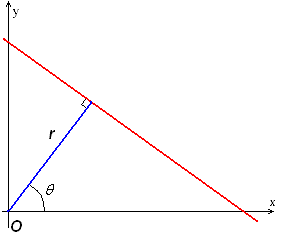
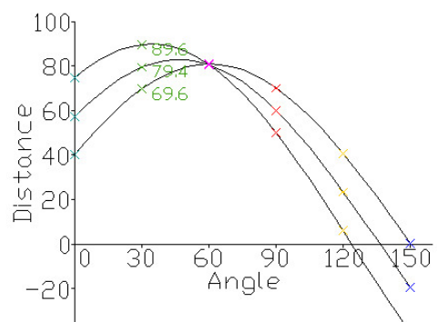
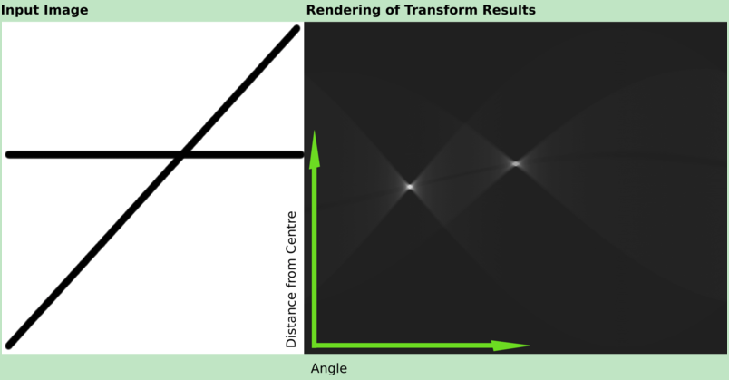
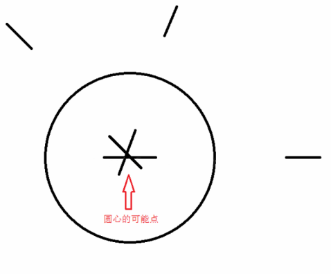

# OpenCV霍夫变换

#### 目录

[TOC]

## 一、霍夫变换原理

简单来说，霍夫变换就是：

* 把图像空间的某种**点集**（如直线，圆），映射为霍夫空间的**点**。
* 把图像空间的**点**，映射为霍夫空间的某种**点集**（如线）。

假设我们要寻找图像空间中的某种点集$X$，它的一个实例是$X_0$，如果$X_0$真的存在于图像空间中，则其包含的每个点经过霍夫变换后得到的许多点集，有一个共同的交点，这个交点代表的就是$X_0$。

因此如果我们将图像空间的所有点都映射到霍夫空间，并且统计霍夫空间中每个点出现的次数，那么出现次数越多的点就表示，在图像空间中越有可能存在这个点对应的点集。通过设置合理的**阈值**，我们就能找出图像空间中的这些点集。

## 二、霍夫直线变换

### 2.1 霍夫直线变换原理

> 本节要解决的主要问题就是：如何将点映射为一条曲线，将直线映射成一个点。

笛卡尔坐标系下的直线只需要两个参数就能唯一确定：截距b和梯度k：
$$
y = kx+b
$$
把这两个参数作为坐标画在另一个图中，就能够实现将直线映射成点的目标。但是，这种方法存在缺陷：当直线竖直时，斜率将发散。

因此需要换一个表示方法，这种方法就是**极坐标方法：**



极坐标方法是过原点作直线的垂线，用垂线的角度以及长度来表示一条直线，$(r,\theta)$，相应的霍夫空间以$\theta \in (0,2\pi)$为横坐标，以$r$为纵坐标。

这样一来，图像中的点被映射为霍夫空间的一条正弦曲线：
$$
y_0=\left(-\frac{\cos\theta}{\sin\theta}\right)x_0+\left(\frac{r}{\sin\theta}\right)\\
y_0,x_0 \equiv C
$$
如取三个红线上的点，根据每个点可以在霍夫空间作一条曲线，这三条曲线的唯一交点代表的就是红线：



下面是wiki百科中的一个例子：



### 2.2 HoughLines函数

此函数可以找出采用标准霍夫变换的二值图像线条。在OpenCV中，我们可以用其来调用标准霍夫变换SHT和多尺度霍夫变换MSHT的OpenCV内建算法。

```cpp
void HoughLines(InputArray image, OutputArray lines, 
                double rho, double theta, int threshold, 
                double srn=0, double stn=0 )
```
* image - InputArray类型，输入图像，即源图像，需为CV_8UC1，可以将任意的源图载入进来后由函数修改成此格式后，再填在这里。
* lines - OutputArray类型，经过调用HoughLines函数后储存了霍夫线变换检测到线条。每一条线由一个两元矢量表示，其中，$\rho$ 是离坐标原点$(0,0)$（也就是图像的左上角）的距离。$\theta$ 是直线旋转角度（0~垂直线，π/2~水平线）。
* rho - double类型，以像素为单位的距离精度。另一种形容方式是直线搜索时的进步尺寸的单位半径。
* theta - double类型的theta，以弧度为单位的角度精度。另一种形容方式是直线搜索时的进步尺寸的单位角度。
* threshold - int类型，累加平面的阈值参数，即识别某部分为图中的一条直线时它在累加平面中必须达到的值。大于阈值threshold的线段才可以被检测通过并返回到结果中。
* srn - double类型，有默认值0。对于多尺度的霍夫变换，这是第三个参数进步尺寸rho的除数距离。粗略的累加器进步尺寸直接是第三个参数rho，而精确的累加器进步尺寸为rho/srn。
* stn - double类型，有默认值0，对于多尺度霍夫变换，srn表示第四个参数进步尺寸的单位角度theta的除数距离。且如果srn和stn同时为0，就表示使用经典的霍夫变换。否则，这两个参数应该都为正数。

### 2.3 HoughLinesP函数

此函数在HoughLines的基础上末尾加了一个代表Probabilistic（概率）的P，表明它可以采用累计概率霍夫变换（PPHT）来找出二值图像中的直线。输入图像必须为8位的单通道灰度图像，一般是采用**Canny边缘检测图**作为输入。

```cpp
void HoughLinesP(InputArray image, OutputArray lines, 
                 double rho, double theta, int threshold, 
                 double minLineLength=0, double maxLineGap=0 )
```

* image - InputArray类型，输入图像，即源图像，需为**CV_8UC1**，可以将任意的源图载入进来后由函数修改成此格式后，再填在这里。
* lines - InputArray类型，经过调用HoughLinesP函数后后存储了检测到的线条的输出矢量，每一条线由具有四个元素的矢量$(x_1,y_1, x_2, y_2）$表示，其中$(x_1, y_1)$和$(x_2, y_2)$ 是是每个检测到的线段的结束点。
* rho - double类型，以像素为单位的距离精度。另一种形容方式是直线搜索时的进步尺寸的单位半径。
* theta - double类型，以弧度为单位的角度精度。另一种形容方式是直线搜索时的进步尺寸的单位角度。
* threshold - int类型，累加平面的阈值参数，即识别某部分为图中的一条直线时它在累加平面中必须达到的值。大于阈值threshold的线段才可以被检测通过并返回到结果中。
* minLineLength - double类型，有默认值0，表示最低线段的长度，比这个设定参数短的线段就不能被显现出来。
* maxLineGap - double类型，有默认值0，允许将同一行点与点之间连接起来的最大的距离。

[回到目录](#目录)

[参考程序](<https://github.com/Liuyvjin/OpenCV_begin/tree/master/EX9>)


## 三、霍夫圆变换

### 3.1 概述

一个圆需要三个参数来表示，分别是原点的坐标和半径。因此可以将圆映射为三维空间中的一个点：$(x,y,r)$

然后采用直线变换类似的方法：将该三维空间离散为一个个累加器，统计经过该点的次数，设定阈值，高于阈值的点表示存在一个圆。

但是这种三维累加器不仅需要大量的内存，并且执行效率很低，因此并不使用。实际中，一般通过“霍夫梯度法”来解决找圆问题。

该算法的出发点是，圆形图像的梯度方向指向圆心，因此只要找到梯度线的交点就能确定圆心。接着统计圆心周边的非零点分布，估计半径即可。

### 3.2 霍夫梯度法

1. 寻找圆心

   （1）用Canny算法进行边缘检测，得到边界二值图。
   （2）用Sobel算子计算原图的梯度。
   （3）遍历边缘二值图中的非0点，沿着梯度方向和反方向画线段（梯度方向为圆弧的法线方向，即半径方向），线段的起点和长度由参数允许的半径区间决定。将线段经过的点在累加器中记数。
   （4）对累计器中的点从大到小排序，记数越大越有可能成为圆心，优先估计半径。
   
   

2. 对某个可能的圆心作半径估计
   （1）计算所有边界图中的非0点离圆心的距离，并从小到大排序。
   （2）从小半径r开始，距离相差在一个小量范围内的点，都认为是同一个圆，记数属于该半径r的非0点数，记为n。
   （3）尝试放大半径，同样记数改半径的点数。
   （4）判断两个半径孰优孰劣的依据——点的线密度（点数n/半径r)，密度越高，半径的可信度越大。
   （5）重复以上步骤，直至半径超过参数允许的范围，从而得到最优半径。

### 3.3 HoughCircles函数

HoughCircles函数可以利用霍夫变换算法检测出灰度图中的圆。它和之前的HoughLines和HoughLinesP比较明显的一个区别是它**不需要源图是二值**的，只需要是8位单通道灰度图，而HoughLines和HoughLinesP都需要源图为二值图像。

```cpp
void HoughCircles(InputArray image,OutputArray circles, 
                  int method, double dp, double minDist, 
                  double param1=100,double param2=100, 
                  int minRadius=0, int maxRadius=0 )
```

* image - InputArray类型，输入图像，即源图像，需为8位的灰度单通道图像。
* circles - InputArray类型，经过调用HoughCircles函数后此参数存储了检测到的圆的输出矢量，每个矢量由包含了3个元素的浮点矢量(x, y, radius)表示。
* method - int类型，即使用的检测方法，目前OpenCV中就霍夫梯度法一种可以使用，它的标识符为CV_HOUGH_GRADIENT，在此参数处填这个标识符即可。
* dp - double类型，用来检测圆心的累加器图像的分辨率于输入图像之比的倒数，且此参数允许创建一个比输入图像分辨率低的累加器。上述文字不好理解的话，来看例子吧。例如，如果dp= 1时，累加器和输入图像具有相同的分辨率。如果dp=2，累加器便有输入图像一半那么大的宽度和高度。
* minDist - double类型，为霍夫变换检测到的圆的圆心之间的最小距离，即让我们的算法能明显区分的两个不同圆之间的最小距离。这个参数如果太小的话，多个相邻的圆可能被错误地检测成了一个重合的圆。反之，这个参数设置太大的话，某些圆就不能被检测出来了。
* param1 - double类型，有默认值100。它是第三个参数method设置的检测方法的对应的参数。对当前唯一的方法霍夫梯度法CV_HOUGH_GRADIENT，它表示传递给canny边缘检测算子的高阈值，而低阈值为高阈值的一半。
* param2 - double类型，也有默认值100。它是第三个参数method设置的检测方法的对应的参数。对当前唯一的方法霍夫梯度法CV_HOUGH_GRADIENT，它表示在检测阶段圆心的累加器阈值。它越小的话，就可以检测到更多根本不存在的圆，而它越大的话，能通过检测的圆就更加接近完美的圆形了。
* minRadius - int类型，有默认值0，表示圆半径的最小值。
* maxRadius - int类型,也有默认值0，表示圆半径的最大值。

[回到目录](#目录)

[参考程序](<https://github.com/Liuyvjin/OpenCV_begin/tree/master/EX9>)

